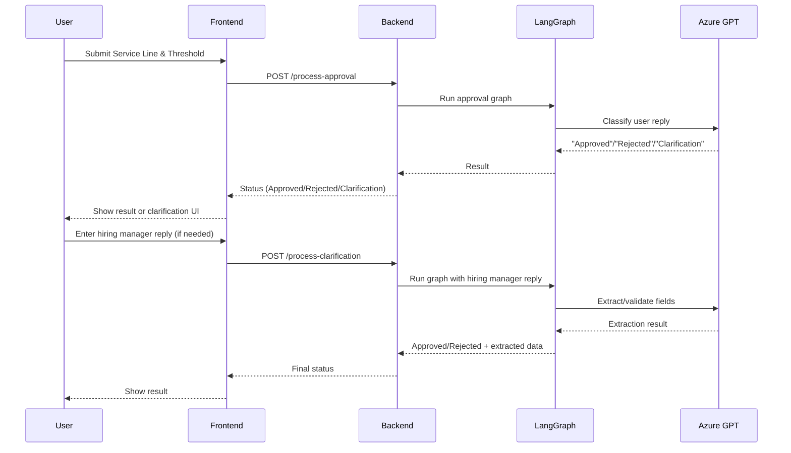

# Approval Application Documentation

## Architecture

```mermaid
flowchart TD
    User[User (Browser)]
    Frontend[Frontend (HTML/TS)]
    Backend[Backend (FastAPI)]
    LangGraph[LangGraph Approval Graph]
    AzureGPT[Azure OpenAI GPT]

    User <--> Frontend
    Frontend <--> Backend
    Backend --> LangGraph
    LangGraph --> AzureGPT
    AzureGPT --> LangGraph
    LangGraph --> Backend
    Backend --> Frontend
```

## Data Flow



## 1. Overview

This application provides a web interface for submitting requests that may require approval based on a numerical threshold. If the threshold exceeds a predefined limit (30), the application generates a sample approval email, prompts the user for a reply, and uses Azure OpenAI GPT (via LangChain/LangGraph) to classify the reply as "Approved", "Rejected", or "Clarification". Requests below or equal to the threshold are automatically approved client-side.

The application consists of:

- **Frontend:** HTML/CSS/TypeScript (Vite). Handles user input, threshold logic, and backend API communication.
- **Backend:** Python FastAPI server. Orchestrates approval logic using LangGraph and Azure OpenAI.

## 2. Project Structure

```
.
├── backend/
│   ├── approval_graph.py  # LangGraph approval workflow
│   ├── azure_gpt.py       # Azure OpenAI API via LangChain
│   ├── main.py            # FastAPI application, API endpoints
│   └── requirements.txt   # Python dependencies
├── frontend/
│   ├── api.ts             # Frontend API client
│   ├── index.html         # Main HTML structure
│   ├── main.ts            # Frontend logic
│   ├── style.css          # CSS styling
├── package.json           # Frontend Node.js dependencies
└── tsconfig.json          # TypeScript configuration
```

## 3. Technology Stack

- **Frontend:** HTML5, CSS3, TypeScript, Vite, fetch API
- **Backend:** Python 3.x, FastAPI, Uvicorn, Pydantic, LangChain, LangGraph, Azure OpenAI, python-dotenv

## 4. Setup and Running

### 4.1 Prerequisites
- Node.js and npm (or yarn)
- Python 3.8+
- Azure OpenAI account with a deployed GPT model

### 4.2 Backend Setup
1.  `cd backend`
2.  Create and activate a virtual environment (optional but recommended)
3.  `pip install -r requirements.txt`
4.  Create a `.env` file in `backend/` with your Azure credentials:
    ```env
    AZURE_OPENAI_ENDPOINT="YOUR_AZURE_ENDPOINT"
    AZURE_OPENAI_API_KEY="YOUR_AZURE_API_KEY"
    AZURE_OPENAI_CHAT_DEPLOYMENT_NAME="YOUR_DEPLOYMENT_NAME"
    AZURE_OPENAI_API_VERSION="YOUR_API_VERSION"
    ```
5.  From the project root, run: `python -m backend.main`

### 4.3 Frontend Setup
1.  `cd frontend`
2.  `npm install`
3.  `npm run dev`
4.  Open your browser to the Vite dev server URL (usually `http://localhost:5173`).

## 5. Workflow

1. **User Interaction:** User opens the web app and submits a Service Line and Threshold.
2. **Threshold Logic:**
   - If `threshold <= 30`: Auto-approved, message shown in UI.
   - If `threshold > 30`: Approval email is generated, user must reply.
3. **Reply Classification:**
   - User reply is sent to backend.
   - Backend uses Azure GPT to classify as "Approved", "Rejected", or "Clarification".
   - If "Approved" or "Rejected": status is shown in UI.
   - If "Clarification": UI prompts for hiring manager details.
4. **Clarification Flow:**
   - UI shows a message to the hiring manager, dynamically including the Service Line and Threshold.
   - Hiring manager reply must be in the format:
     ```
     Name: <Full Name>
     Years of Experience: <Number>
     SL to SL change: <From> to <To>
     ```
   - On submit, backend uses Azure GPT to extract and validate these fields.
   - If all fields are present, status is "Approved" and extracted data is shown.
   - If any field is missing, status is "Rejected" and UI shows "Rejected. Missing or invalid hiring manager details."

## 6. Key Features and Changes

- **Consistent Statuses:** All negative outcomes are now labeled as "Rejected" (not "Not Approved").
- **Clarification Extraction:** Uses Azure GPT to extract and validate required fields from hiring manager reply. If any are missing, backend returns which fields are missing (for debugging/logging), but UI always shows a user-friendly message.
- **Dynamic Clarification Message:** The clarification prompt to the hiring manager now includes the actual Service Line and Threshold for context.
- **Improved UI Feedback:** The UI displays clear, consistent messages for all approval, rejection, and clarification scenarios.
- **Graph Logic:** The approval graph only processes clarification if a hiring manager reply is present, preventing premature errors.
- **Field Format Enforcement:** The clarification message and default reply textarea guide the user to provide the required format.

## 7. API Reference

### `/process-approval` (POST)
- Request: `{ service_line, threshold, approval_email, user_reply }`
- Response: `{ status: "Approved" | "Rejected" | "Clarification" | "Auto-Approved", detail, extracted_data? }`

### `/process-clarification` (POST)
- Request: `{ service_line, threshold, approval_email, user_reply, hiring_manager_reply }`
- Response: `{ status: "Approved" | "Rejected", detail, extracted_data? }`
- If required fields are missing, returns 400 with detail: "Missing or invalid hiring manager details."

## 8. Error Handling
- **Frontend:** Shows clear error or rejection messages in the UI.
- **Backend:** Returns 400 with a user-friendly message if clarification fields are missing.

## 9. Improvements & Notes
- All status and error messages are now consistent and user-friendly.
- The system is robust to missing or malformed clarification replies.
- The graph and prompt logic are easy to extend for future requirements.